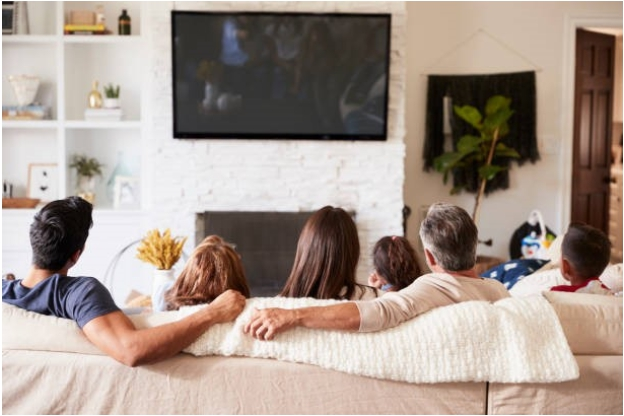

# Stage two tasks:

## Description of project idea 
Our project idea is astreaming service. However, unlike other streaming services where a limited number of movies and shows isavailable, ours will compile all media from a variety of streaming services into one convenient location. It will be made available through a website, as well as have an accompanying mobile applicationto enable  users  to  access  their movies  and  shows  on the  go.  By  allowing  users  to  link  their streaming services to ours, users will be able to browse through the libraries of all their streaming services and watch their favorite movies and shows seamlessly. Furthermore, users will be able to search for media across services, compare ratings, and manage watchlists all within our service. Finally, there will be social features included, which would allow users to see what their friends are watching and even watchwith them. This service is targeted towards people who are  subscribed to multiple streaming services, as its purpose is to simplify searching and trackingmovies and shows across streaming services

## List of stakeholders 
Customers (i.e., Streaming Service Subscribers):Customers  will  use  our  service  primarily  for  watching  movies  and  shows,  as  well  as  browse through media across streaming services. They will be experienced with other streaming services, which should allow them to easily migrate to our service. Customers will be able to do all actions already  available  on  their  preferred  streaming  services  (e.g.,  watch  movies,  search  for  shows, manage watchlists), as we only plan to compile streaming services, not reinvent wheels. As well, customers will be able to connect with their friends through familiar social features.Streaming Service Providers:Streaming  service  providers  will  have  their  media  made  available  on  our  service.  Through  this partnership,  streaming  service  providers  will  be  able  to  boost  sales,  asthe  inconvenience  of having  many  separate  streaming  services  will  no  longer  be  a  barrier  that  prevents  users  from subscribing.

## User research method one Fly on the Wall (Look) 
The first research method we chose was Fly on the Wall. For this method, I decided to watch a few shows with my roommates and see how they would interact with the myriad of streaming services to which they are  subscribed. First,  they browsed through the Netflix  library,  looking  for  an  interesting  show.  While scrolling through the library, shows started automatically playing, which yielded a few complaints from my roommates. Unable to find a show on Netflix, my roommates decided to switch over to Disney+.  After 10 minutes of indecision, one of them suggested the show The Boysand searched it up. However, it was not on Disney+, so they had to search the internet to check which site it was on. This led them to Amazon Prime Video, where they found the show and started watching. Through this experience, I learned that picking something to watch is not always easy and fast, which often results in having to switch between sites. For instance, my roommates browsed through three different libraries before picking a show. And they eventually selected a show that was quite trendy. Thus, they could have greatly benefited from an ability to sort or filter through movies and shows based on release date or popularity. They also suggested other  shows  they  had  heard  of,  but  often  did  not  know  which  site  they  were  on,  causing  them  to constantly search the internet and switch between sites.

## User research method two Surveys & Questionnaires (Ask) 
The second research method we chose was Surveys & Questionnaires. For this method, I set up a series of questions and asked people for their opinions. Refer to Appendix A for the questions.After conducting the survey, I learned that younger people (15-30 years of age) use  streaming services more than older people, and most of these individuals spend at least 5 hours per week using streaming services. As well, I found that searching for specific movies and shows is frustrating for many individuals. If they are unable to find a specific movie or show on their current service, they usually search manually on the internet to see which service has it. Another thing I found interesting is that, due to the pandemic, many individuals are interested in watching movies and shows with friends, but they are unsure of how to do it without meeting physically.

## User research method three Scenario Testing (Try) 
The third research method we chose was Scenario Testing. For this method, I created scenarios and asked people  what  they  thought ofthem.  The  first  scenario,  which  is  the  simplest  solution  to  finding  which streaming  service  has  a  movie,  is  to  create  a  website witha  database  of  movie  titles  and  streaming services.  In  the  database, movie  titles  will  be  linked to  streaming  services  where  they  are  available.  As well, there will be a discussion section to fulfill the social aspect. Most participants found this scenario to be an acceptable solution but not one that they would regularly use. Though this approach would reduce the time spent in searching for movies and allow users to interact with other people, most participants would  rather  have  their  streaming  services  integrated  into  a  website  in  a  manner  similar  to  YouTube where all content are searchable and viewable on one site. This brings us to the second scenario, which is to create an application with a similar database as in the first scenario but include all the video playingfunctions  that a  typicalstreaming  service  would  have,  as  well  as  the  actual  media  from  the  different streaming services. As for the social aspect, the application will not only include a discussion section but also a feature to allowusers to commenton-screen in real time. Most participants said this was a better solution to accomplish streaming service compiling butraised concerns about copyright  and spoilers in the chat.

## Justification of research methods 
We believe the IDEO method cards we chose will provide the insight required to design a streaming service compiler with social features. This is because they all highlighted similar issues regarding having to juggle multiple streaming services. For instance,  through all research methods, we determined that  having to switch  streaming  services  to  find  a  specific  movie,  or  even  just  browse  collections,  is  something  many people  are  not  fond  of.  Furthermore,  by  using  research  methods  from  three  different  IDEO  method categories (Look, Ask, and Try), we were able to obtain different perspectives on similar issues. Through Fly  on  the  Wall,  we  were  able  to  see  firsthand  the  issues  people  were  facing  with  current  streaming services. Through Surveys & Questionnaires, we were able to obtain information from potential users of our  service  regarding  what  could  be  missing from or improved  oncurrent  streaming  services.  Finally, through Scenario Testing, we were able to evaluate initial design ideas by asking potential usersto react tothem. Overall, ourchosen IDEO method cards made research much more focused and organized, and the information we obtained through them have made it easier for us to narrow down our design ideas.

## What went well, what went poorly 
As mentioned earlier, using these research methods provided us with a lot of information about how we should design the streaming service compiler. They allowed us to understand how users currently interact with  streaming  services  and  think  of  ways  to  facilitate  these  interactions.  We  also  gained  information about potential issues with our idea, which should allow us to ensure that they are considered and avoided when creating our design. However, there were some limitations to how we could conduct our research. For  instance,  we  could  not  use  our  chosen methods on  a  wide range  of  individuals  because  we  had  to abide by social distancing guidelines. This meant we could only gain insight from people who were very accessible, limiting the scope of our research.

## List of 8 user tasks 
The following are must-be-includedfeatures, whichdeal with the media streaming aspect of our project.These features must be included since they form the foundation of what we want to provide to our users, which is a way to compile all their streaming services into one place.
1.Add/remove/manage streaming servicesby linking/unlinking them toanaccounton our side
2.Browse librariesof movies/showsbyscrolling through an array of representativethumbnails
3.Search for specific movies/showsusingasearch bar with ‘as-you-type’suggestions
4.Watch movies/showsusinganembedded videoplayer

The following are importantfeatures, whichdeal with the social aspect of our project.These features are important since they set us apart from current streaming services, whichdo not providesocial features.

5.Add/remove/manage friendsthrough a dedicated friends list page/UI
6.Invite/join friends to watch movies/showsusingthe previously mentioned video player
7.Enable/disable sharing of watch activityusing a slider buttonthat isaccessiblein all pages

The following are could-be-includedfeatures, whichdeal with the quality oflife aspect of our project.They are not required to complete our project, but they would be nice to have, since they enhanceand makeit easier to use our service.

8.Filter/sort librariesby streaming service, as well as genre,release date, popularity,etc.

## Appendix 
Appendix A:
The questions used in Surveys & Questionnaireswere:
1.How old are you?
2.Have you used online streaming services before (e.g., Netflix, Disney+, Amazon Prime Video)?
3.How often do you use online streaming services?
4.How do you look up a specific movie or show to watch?
5.Have you ever thought of watching movies or shows with friends? How would you do it?Keep in consideration that we are in the middle of a pandemic?

